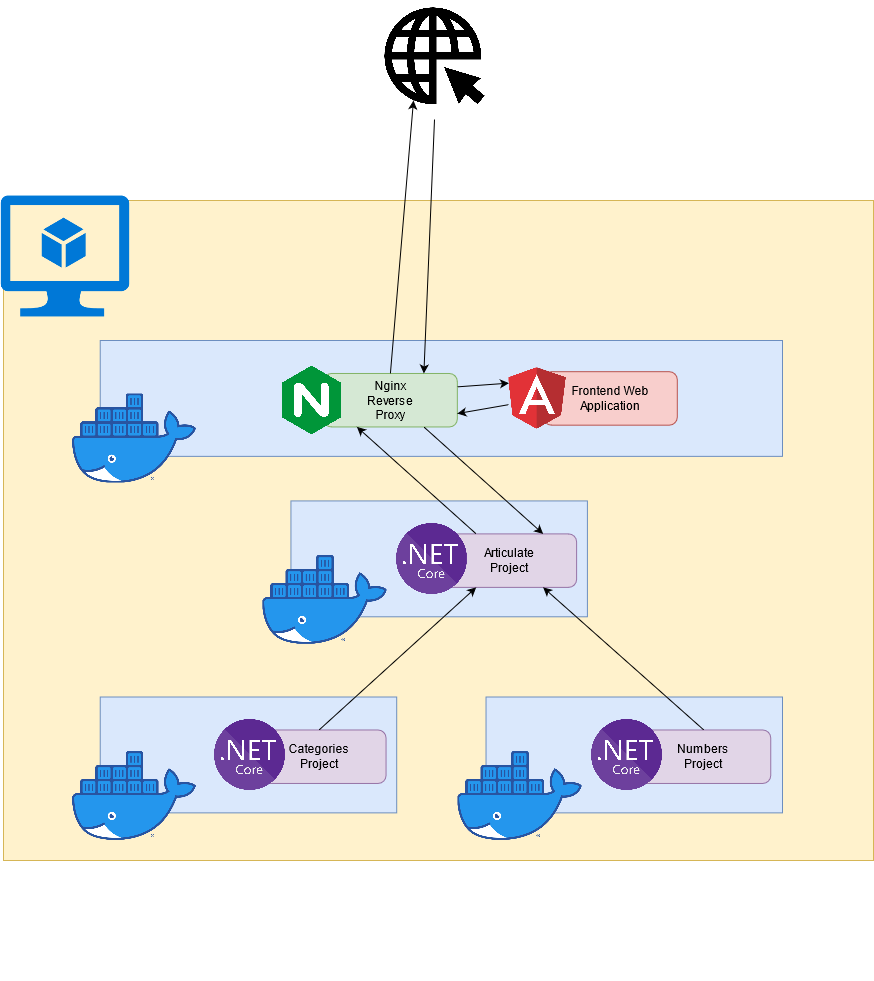
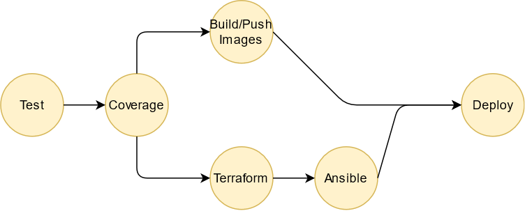

# Avanade Practical Project: 
# Articulate :pencil:

>***TASK***: To create an application with the utilisation of DevOps
> methodologies and technologies that were covered during training.

# Contents
  - [Introduction](#introduction)
  - [Requirements Analysis](#requirements-analysis)
    - [Game Rules](#game-rules)
    - [User Stories](#user-stories)
    - [Requirements](#requirements)
  - [Planning](#planning)
  - [Architecture](#architecture)
    - [Networking](#networking)
    - [Nginx Reverse Proxy](#nginx-reverse-proxy)
  - [Pipeline](#pipeline)
    - [Test](#test)
    - [Coverage](#coverage)
    - [Build/Push Images](#build/push-images)
    - [Terraform](#terraform-job)
    - [Ansible](#ansible)
    - [Deploy](#deploy)
  - [Risk Assessment](#risk-assessment)
  - [Future Work](#future-work)


## Introduction

The aim of this project is to create a simplified and minimal solution of [articulate](https://www.drumondpark.com/articulate), a fast talking description Game. This document provides details of design and implementation of the project. 

## Requirements Analysis

### Game Rules

The rules of the game have been adapted for this project but the heart of the game remains the same. In the game users are split into teams of 2 or more. A single member of the team is given a randomly generated word from one of six categories: Person, Nature, Object, Action, World or Random. This person has to describe the word given to them without saying the actually word to the rest of his team. The other members of the team must guess the chosen word within the given time limit.

### User Stories
* As a user, I need a random word, so that I can describe it to other members of the team
* As a user, I need a timer to be displayed, so that I know how much time I have left to describe the word
* As a user, I need to be abe to pause the timer, so that I can pause the game
* As a user, I need to be able to start the timer, so that I can start the game
* As a user, I need a new word generated when the timer is up, so that the next player can have their turn describing a new word

### Requirements
The user stories in the project were transformed into a more succint list of requirements.

* The web application should generate a random word for the user to describe
* The web aplication should include a timer
* The web application should allow the timer to be paused
* The web application should be able to start the timer
* The web application should be refreshed when the timer is up


## Planning

The plannng for this project was completed using a kanban board inside of a GitHub project. Doing it in this ay allows for referring to an issue in commit messages, as linking pull requests to issue, such that issues are clode when requests are merged. Due to the small number of requirements/features of this project it didn't make sense to split up the work into issues based on the requirements. Issues were created based on the architecture of the project instead. Issues were created for each service, implementing docker compose and the pipeline etc.

## Architecture
The project contains 4 services: frontend, articulate, categories and number. The fronted service is responsible for generating serving the webpage for users to interact with and to display the output from the articlate service. The numbers service generates a random number from 1 to 100. The categories service selects one of the six categories mentioned in section 1 at random. Finally, the articulate service takes the output from the numbers and categories services' and use them to select word  from a table written in a csv file.



### Networking
Each service inside of this project has been containerised for deployment. Containerisation of these services made networking simplistic, as each container was connected to the same docker network where the name of the container is the hostname for the container on the docker network.

### Nginx Reverse Proxy
An nginx reverse proxy was used inside of the frontend container as an intermediary proxy service. The nginx service handles incoming http requests from clients over the internet and serves the angular app running also running inside of the frontend container. Furthermore, the proxy redirects any requests made to `/articulate` path will be redirected to the articulate service running on the articulate container.

## Environments
The directory `./config/` contains to environment variable files for development and production environments (`.dev.env` and `.prod.env`). These files can be used with the following command:

```
$ docker compose --env-file <path/to/file> up 
```

During the creation of the project this was a useful feature which enabled me to easily switch between deploying the containers locally and to an azure VM. The main difference between the files is that the frontend container maps to the port 80 on the host machine in the production environment and port 8080 in the development environment. 

## Deployment

All 4 containers (services) were deployed to an azure VM using `docker-compose`, where the frontend could be accessed by a public ip address or the dns name set in the terraform. The [Environment](#environment) section refers to using docker compose in different environments. In order, to deploy the containers in a  virtual machine remotely, the context feature of docker was also utilised, by switching docker contexts you are able to run docker commands remotely over an ssh connection.  

### Terraform 

All of the terraform inside of this project can be found in the `./terraform` directory. The terraform creates a virtual machine, virtual network, storage account, network interface card, public ip address, network security group and a resource group on the Azure cloud platform. Additionally, the terraform is configured to use azure as a backend. This means that the terraform state is stored in azure and is helpful feature for running terraform in a pipeline. 

### Ansible 

All of the ansible for this project can be found in the `./ansible` directory. The playbook and inventory are run on the GitHub Actions Runner to configure the deployment of the production virtual machine. 

## Pipeline

Github actions were used to create the pipeline for this project. The pipeline workflow for this project can be found in `.github/workflows/ci.yaml`. The pipeline is set to run after pushing or creating a pull request. The pipelne contains 6 different jobs: test, coverage, terraform, ansible, build/push images and deploy.



### Test

The test job just runs the dotnet test command, which will run all of the unit tests located in the `./tests` directory, all of the test run locally and utilise mocking to control the flow of execution of the code. Only the files containing the controllers were tested in this project. This job output the coverage report as xml file and uploads it as an artifact, so that the output can be used in the coverage job.

### Coverage

This job downloads the coverage xml file as an artifact and publishes the coverage report but only on a **pull request**.

### Build/Push Images

This job requires both the test and coverage jobs to have been successful before running. This job is ran to build and push the docker images using the dockerfiles and the code found in the repository. All of the images built are pushed to registries on my docker hub account [wray27](https://hub.docker.com/u/wray27), the runner authenticates itself by using GitHub Secrets.

### Terraform Job 

The terraform is used to create an azure virtual machine and all of its associated resources, as mentioned in the [#Terraform](#terraform) section the state of the terraform is stored in azure. Therefore, if the VM is already up the terraform can check this and run this job successfully. This job authenticates the GitHubs Actions runner with Azure using an azure service provider, which was created and passed to the runner using GitHub Secrets.

### Ansible

This job configures the production virtual machine running all 4 services. It installs docker/docker-compose on the VM and configures the VM to allow the **azureuser** setup on the VM to run docker without **root** privelleges.

### Deploy

First, this job installs the SSH private key from the GitHub Secrets. Then this job deploys all 4 services to the virtual machine running in azure using the production environment file from the [Environments](#environments) section.

## Risk Assessment


| Risk                                                                                                                                                                                                                                            | Likelihood | Severity | Control Measure | Response                                                                                                               | Revisit Date |
| ----------------------------------------------------------------------------------------------------------------------------------------------------------------------------------------------------------------------------------------------- | ---------- | -------- | --------------- | ---------------------------------------------------------------------------------------------------------------------- | ------------ |
| An adversary obtains access to production virtual machine                                                                                                                                                                                       | Low        | High     | Prevent         | Using SSH key only authentication, alonside GitHub secrets so that nly devices with the key can have access to the VM  | N/A          |
| The web application current Cross Origin Resource Sharing policy allows for any origin to have access to resources within the web app. This could lead to cross domain based attacks.                                                           | Low        | High     | Prevent         | Restrict the web application from interacting with resources outside of its domain by applying                         | 07/2021      |
| The web application uses the http protocol. Therefore, the traffic between the client and the web application is unencrypted. The website is subsecptible to man in the middle attacks.                                                         | Medium     | Medium   | Prevent         | Create an SSL Certificate and update the web application's protocol to use https                                       | 07/2021      |
| An adversary is able to obtain my Azure and Docker Hub                                                                                                                                                                                          | Low        | High     | Prevent         | All credential used with in the runner are injected using GitHub Secrets, which are encryoted environment variables    | 07/2021      |
| web application's are often supsectible to distributed denial of service attacks where many fradulent requests are made to the web application in attempt exhaust the application's resources and stop legitimate requests from getting through | Low        | High     | Prevent         | Azure DDoS Protection Basic helps protect all Azure services and requires no user configuration or application changes | N/A          |

## Future Work

The infrastructure for this project operates correctly and the web application along with all of the resources required to run it can be deployed from scratch using the pipeline created in GitHub Actions. However, due to time constraints of the project the web application remians unfinished. Both the functionality and the aesthetics of the webiste can be improved.

